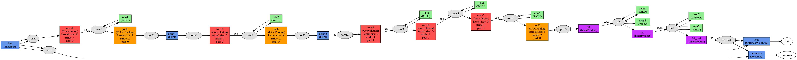

# Fine-tuning CaffeNet for Pet Breed Recognition

We fine-tuned CaffeNet to discriminate dog and cat breeds using [The Oxford-IIIT Pet Dataset](http://www.robots.ox.ac.uk/~vgg/data/pets/). Our model achieved a ~79% accuracy, higher than the ~59% accuracy in the original paper.

We evaluated the effect of learning rate, batch size, and additional layer on our loss and test accuracy.

Here is an example of our prototxt that defines our hyper-parameters: 
```
net: "models/cats_and_dogs/train_val_batch_size_16.prototxt"
test_iter: 60
test_interval: 500
base_lr: 0.001
lr_policy: "step"
gamma: 0.2
stepsize: 2000
display: 50
max_iter: 10000
momentum: 0.8
weight_decay: 0.0005
snapshot: 1000
snapshot_prefix: "models/cats_and_dogs/train_val_batch_size_16.prototxt"
```
Our `test_iter` is set to `60` and `test_batch_size`(in train_val.prototxt) is set to `64` so that each test covers all ~3700 test data. We run a test every `500` iterations of training to check accuracy and loss. Our base learning rate is `0.001`, and we decrease our learning rate by a factor of `0.2` every `2000` iterations. We set our `delta` for the regularizer to be `0.0005`, and momentum to be `0.8`. We display the loss every `50` iterations, saves a snapshot for the model every `1000` iterations, and run a max of `10000` iterations.

We use CaffeNet, a pre-trained model as our base model. We modified the last layer of CaffeNet from 1000 nodes to 37 nodes to the number of output for our problem. Below is a visualization of our model:




For learning rate, we found out that freezing weights of all previous layers helps us to coverge much quicker. We also found out that a small learning rates (smaller than the flickr example) is helpful. It is possible that we might achieve a better result by finetuning weights in all layers if we train the model for a long time (and have more data), but initial result suggests that our accuracy decreases after `500` iterations if we do not freeze all layers but the last one.

Our experiment on batch size did not show significant difference in test accuracy. While a large batch size converges quicker under the same number of iterations and learning rate, in our case it is mostly due to the number of examples our model has seen (`8000` iterations for batch size `4` = `500` iterations for batch size `64` in terms of number of examples seen).

Finally, we do not see significant difference if the `37` node last layer simply replaces the original `1000` node last layer or is placed after the original last layer. 

Our tools for preprocessing data and postprocessing result can be found under `/java`. Our model definition can be found under `/models/cats_and_dogs/`.


Following is the original README:

# Caffe

[](https://travis-ci.org/BVLC/caffe)
[](LICENSE)

Caffe is a deep learning framework made with expression, speed, and modularity in mind.
It is developed by the Berkeley Vision and Learning Center ([BVLC](http://bvlc.eecs.berkeley.edu)) and community contributors.

Check out the [project site](http://caffe.berkeleyvision.org) for all the details like

- [DIY Deep Learning for Vision with Caffe](https://docs.google.com/presentation/d/1UeKXVgRvvxg9OUdh_UiC5G71UMscNPlvArsWER41PsU/edit#slide=id.p)
- [Tutorial Documentation](http://caffe.berkeleyvision.org/tutorial/)
- [BVLC reference models](http://caffe.berkeleyvision.org/model_zoo.html) and the [community model zoo](https://github.com/BVLC/caffe/wiki/Model-Zoo)
- [Installation instructions](http://caffe.berkeleyvision.org/installation.html)

and step-by-step examples.

[](https://gitter.im/BVLC/caffe?utm_source=badge&utm_medium=badge&utm_campaign=pr-badge&utm_content=badge)

Please join the [caffe-users group](https://groups.google.com/forum/#!forum/caffe-users) or [gitter chat](https://gitter.im/BVLC/caffe) to ask questions and talk about methods and models.
Framework development discussions and thorough bug reports are collected on [Issues](https://github.com/BVLC/caffe/issues).

Happy brewing!

## License and Citation

Caffe is released under the [BSD 2-Clause license](https://github.com/BVLC/caffe/blob/master/LICENSE).
The BVLC reference models are released for unrestricted use.

Please cite Caffe in your publications if it helps your research:

    @article{jia2014caffe,
      Author = {Jia, Yangqing and Shelhamer, Evan and Donahue, Jeff and Karayev, Sergey and Long, Jonathan and Girshick, Ross and Guadarrama, Sergio and Darrell, Trevor},
      Journal = {arXiv preprint arXiv:1408.5093},
      Title = {Caffe: Convolutional Architecture for Fast Feature Embedding},
      Year = {2014}
    }
